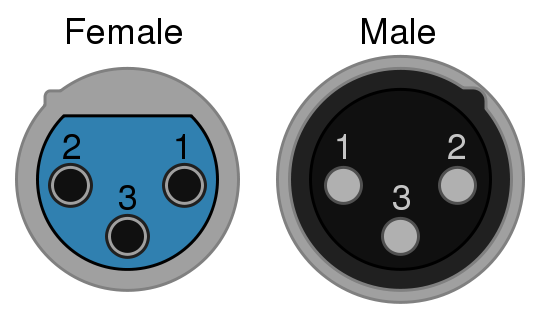

# Lexicon

Here is terminology that is helpful to keep straight among teams.

---
## Schedule

### Load in (or Setup)
> Sound team and crew sets up. This is also time for musicians who need additional setup time like drums and guitars with amplifiers.

### Sound Check
> This is focused time for the sound team to work with each musician to ensure they have their line levels at acceptable levels and they monitor needs are taken care of.

### Rehearsal
> This is not sound check as this is focused time for musicians to practice their songs. Sound Team can also practice and hone their sound for the service during this time.

### Call (or Call Time)
> When musicians and their support crew should be ready to go on stage. This typically is fifteen minutes before "Go".

### Go time
> Service Start Time

### Strike
> To clean up or clear the stage. This can be done in preparation for

---
## Location
**Most location directions are from the perspective of the sound person at the sound board.**

### Front of House (FOH)
> Where the sound board is

### Back of House (BOH)
> Behind the stage

### Stage Reft
> The left portion of the stage from the perspective of FOH.

### Stage Right
> The right portion of the stage from the perspective of FOH.

---
## Cables

### XLR (or Mic Cable)
> This is a [balanced]() cable that is typically used for microphones and connecting Direct Input boxes (DI) to the sound board. They are also used for connecting [passive]() speakers and monitors to the sound system.

(image CC by [Omegatron](https://commons.wikimedia.org/wiki/User:Omegatron))

| Pin |	Function |
|---|---|
| 1 |	Chassis ground (cable shield) |
| 2 |	Positive polarity terminal for balanced audio circuits (aka "hot") |
| 3 |	Negative polarity terminal for balanced circuits (aka "cold") |

### Quarter Inch, 1/4" (or Instrument Cable)
  * Stereo
  > Tip, ring, sleeve

  * Mono:  
  > Tip, sleeve

### Rivering
> To organize, sometimes taping down, cables on the stage.

**Ensure that power and sound cables are not rivered together if at all possible so that you can avoid unwanted noise that can come from power.**

---
## Other

### Rider
> The list of requirements from the band/musicians for the venue or sound team to provide.

[Example Rider](examples/example-rider.md)
